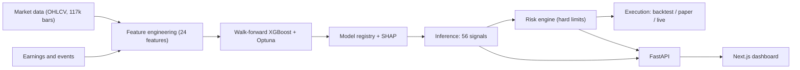

<div align="center">

# QuantML

**A machine learning system that scores NASDAQ-100 stocks — and shows you exactly why it made each call.**

### 🔗 [**Try the live demo →**](https://quant-ml-flax.vercel.app)

<br/>

[](https://python.org)
[](https://typescriptlang.org)
[](https://nextjs.org)
[](https://fastapi.tiangolo.com)
[](https://xgboost.readthedocs.io)
[](.)

<!-- Demo recording: film cinematic mode (Pipeline → Replay → Backtests), export a GIF to docs/demo.gif, then uncomment:

-->

</div>

---

## What this is

QuantML takes eight years of daily market data, turns it into features a model can actually learn from, trains an XGBoost classifier without ever letting it peek at the future, and scores every stock in the NASDAQ-100 as **BUY**, **HOLD**, or **AVOID**.

The part I cared most about is the second half of that sentence: it doesn't just hand you a prediction. Every signal comes with a confidence score, an expected 5-day return, a risk level, and the specific features that drove the decision. You can pick any past call and watch what actually happened next — including the ones the model got wrong.

It runs end to end. Data ingestion, feature engineering, training, backtesting, risk limits, an API, and a dashboard. Nothing here is a mockup.

> **Scope:** this is a research platform, not a trading bot. It never places an order — live trading is disabled at the code level, not just by config. Signals are probabilistic model output, not financial advice.

---

## Take the tour

The demo is the fastest way to understand it. Five minutes, no signup:

| Page | What to look at |
|---|---|
| **Pipeline** | A walkthrough of one real call, from raw data → features → training → prediction → the profit it captured |
| **Signal Replay** | Pick a call, hit play, and watch the real price path that followed. Wins *and* misses |
| **Backtests** | Drag the transaction-cost and slippage sliders and watch the returns change live |
| **Signals** | All 56 current calls, each with its confidence and the features behind it |
| **Research** | Ask "why did the model call INTC a BUY?" in plain English and get a grounded answer |
| **Validation** | The unglamorous part — walk-forward tests, drift checks, regime analysis |

---

## How it works

Five stages, run as one pipeline:



1. **Ingest** — pull 8 years of daily prices for 55 NASDAQ-100 names (117,561 rows).
2. **Build features** — turn raw prices into 24 signals the model can use: momentum, volatility, mean-reversion, volume. Each one is z-scored *across* stocks on the same day, so the model compares like with like and can't leak information from the future.
3. **Train** — XGBoost, validated walk-forward across 6 expanding folds. Each fold trains only on the past and is tested on data it has never seen. This matters more than it sounds: standard k-fold cross-validation leaks future information into training and inflates results by roughly 0.1–0.2 Sharpe.
4. **Score** — rank today's cross-section into BUY / HOLD / AVOID, and pull the per-stock SHAP values so every call is explainable.
5. **Size and check** — signals pass through a separate risk engine (position caps, sector caps, exposure limits) before they become proposed orders. The model never executes anything directly.

---

## Does it actually work?

Short answer: **yes, but modestly — and I'd rather show you that than dress it up.**

The model finds a real edge, and it's a small one. That's the honest result for this kind of problem, and any project claiming a Sharpe above 2 on retail data is almost certainly overfitting.

| | Result | What it means |
|---|---:|---|
| **Classification AUC** | 0.540 | vs 0.500 for a coin flip. Small, but real and out-of-sample |
| **Signal Sharpe** | 1.19 | The raw ranking ability, before trading costs |
| **Net-of-cost Sharpe** | 0.88 | What's left after commission and slippage |
| **Return vs benchmark** | 112% vs 90.5% | Strategy vs buy-and-hold QQQ, same period |
| **Max drawdown** | −29.7% | The worst peak-to-trough loss along the way |

That gap between 1.19 and 0.88 is the interesting number. It's what trading costs take out of a strategy, and most backtests quietly hide it. The Backtests page lets you move the cost sliders yourself and watch the edge disappear if you set them high enough.

<details>
<summary><b>The full validation work</b> — walk-forward, drift, regimes, calibration, overfitting checks</summary>

<br/>

Every number above comes from 6-fold expanding walk-forward cross-validation. No fold ever sees its own future. Beyond that:

- **Live-cadence walk-forward** — re-run anchored weekly to mimic how it would actually be used, rather than a single clean split.
- **Training-window sensitivity** — swept the lookback window to check the result isn't an artifact of one arbitrary choice.
- **Regime-specialised models** — tested whether separate bull/bear models beat one general model (they mostly don't, which is itself worth knowing).
- **Out-of-distribution test** — held out a later era entirely and measured feature drift with PSI.
- **Probability calibration** — checked whether a stated 60% confidence actually means 60%, using Brier score and expected calibration error, then tested confidence-weighted position sizing.
- **Retrain cadence** — measured how quickly performance decays without a refit, to work out how often it genuinely needs retraining.
- **Deflated Sharpe Ratio** — corrects for the fact that testing many strategies will eventually produce a good-looking one by luck. Backed by an append-only trial registry that records every experiment, so the correction uses the real trial count instead of a flattering one.

Full numbers and charts are on the **Validation** page of the demo.

</details>

---

## Running it yourself

**You need:** Python 3.11+ and Node.js 20+

**Just want to see the dashboard?** It ships with the real measured results baked in, so the frontend runs on its own — no backend, no Python, no API keys:

```bash
npm install
npm run dev          # → http://localhost:3000
```

**Want to run the actual ML pipeline?**

```bash
# 1. Python environment
python -m venv .venv
.venv\Scripts\activate            # Windows
# source .venv/bin/activate       # macOS/Linux
pip install -r ml/requirements.txt -r backend/requirements.txt

# 2. Run the pipeline (one-time, ~5 min on a laptop)
python -m ml.ingestion.download    # downloads 117k daily bars
python -m ml.features.build        # builds the 24 features
python -m ml.training.walk_forward # trains, 6-fold walk-forward
python -m ml.inference.score       # scores today's cross-section

# 3. Start the API
cd backend && uvicorn main:app --reload --port 8000
# docs → http://localhost:8000/docs
```

To point the dashboard at the live API instead of the baked-in results, add `NEXT_PUBLIC_API_URL=http://localhost:8000` to `frontend/.env.local`.

**Run the tests:**

```bash
pip install -r requirements-dev.txt
ruff check ml backend tests
pytest                             # 138 tests
```

**Or just use Docker:**

```bash
docker compose up --build
# dashboard → localhost:3000 · API → localhost:8000
```

To put your own copy online, deploy the `frontend/` directory to Vercel — it runs standalone on the baked-in results, so there's no backend to host.

---

## A few things I'd point out

**Live trading can't happen by accident.** Execution runs through a swappable adapter with three modes — backtest, paper, live — and `live` throws a `RuntimeError` unless an explicit environment flag is set. Turning it on later is a config change, not a rewrite. Right now it's off.

**It degrades gracefully instead of breaking.** If the model artifacts aren't built, the API serves seeded fallbacks. If the API is offline, the dashboard does the same and shows a "Sample data" badge so you always know what you're looking at. That's also how the test suite runs entirely offline on a cold checkout.

**The tests cover the things that matter.** 138 of them, run on every push alongside lint and a production build. They exercise the cost model, risk caps, labelling, and the live-trading lock — the parts where a silent bug would be expensive.

---

## Tech stack

- **ML** — Python, XGBoost, pandas, NumPy, scikit-learn, Parquet feature store, Optuna
- **Backend** — FastAPI, Pydantic v2, uvicorn, pytest, ruff
- **Frontend** — Next.js 15 (App Router), React 19, TypeScript, Tailwind v4, Recharts, Framer Motion
- **Infra** — Docker Compose, GitHub Actions CI, Vercel

---

## Project layout

```
QuantML/
├── ml/            Data → features → training → inference, plus research tooling
│   ├── ingestion/   Yahoo chart API → parquet
│   ├── features/    24 features, cross-sectionally z-scored
│   ├── training/    6-fold walk-forward XGBoost
│   ├── inference/   Scores the latest cross-section + SHAP
│   └── research/    Trial registry, drift, regimes, ablation
│
├── backend/       FastAPI
│   ├── execution/   Adapter hierarchy — backtest / paper / live (hard-gated)
│   ├── portfolio/   Risk engine: signals → sized orders
│   └── backtesting/ Cost-aware walk-forward engine
│
├── frontend/      Next.js dashboard
├── tests/         138 pytest tests
└── data/          Pipeline artifacts (gitignored)
```

---

<div align="center">

**Research platform. Signals are probabilistic model output — not financial advice.**

</div>
