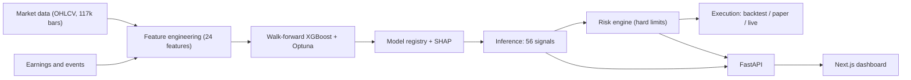

<div align="center">

# QuantML

**A production-grade quantitative research platform** — from raw market data to explainable ML signals, portfolio construction, risk control, and a live full-stack dashboard.

### 🔗 [**Open the live demo →**](https://quant-ml-flax.vercel.app)

<br/>

[](https://python.org)
[](https://xgboost.readthedocs.io)
[](https://fastapi.tiangolo.com)
[](https://nextjs.org)
[](https://typescriptlang.org)
[](.)
[](.)

<!-- Demo recording: film cinematic mode (Pipeline → Replay → Backtests), export a GIF to docs/demo.gif, then uncomment:

-->

</div>

---

## Overview

QuantML is an end-to-end system for generating and evaluating equity trading signals. It ingests eight years of daily market data across the NASDAQ-100, engineers 24 cross-sectional features, trains a gradient-boosted classifier under walk-forward validation, converts model output into a risk-constrained portfolio, and simulates that portfolio net of realistic transaction costs.

Two design principles run through it.

**Every prediction is explainable.** No signal is emitted as a bare label. Each carries a confidence score, an expected 5-day return, a risk classification, and per-name SHAP attributions identifying the features that drove the decision. The dashboard surfaces all of it, including the calls the model got wrong.

**Live execution cannot happen by accident.** The model never places an order. Signals pass through a separate risk engine before becoming proposed orders, and the execution layer is a swappable adapter whose `live` implementation raises a `RuntimeError` unless an explicit environment flag is set. Enabling paper or live trading later is a configuration change, not a rewrite.

The near-term roadmap is paper trading against a broker API, then gated live execution — the interfaces for both already exist.

---

## What's inside

**Data and features**
- Direct ingestion from the Yahoo chart API (no SDK dependency), with split and dividend adjustment via the `adjclose` ratio — 117,561 daily bars across 55 names.
- 24 engineered features spanning momentum (`ret_5/20/60/120`), trend (`sma20/50/200_dist`), volatility (`vol_20/60`, `vol_of_vol`, `atr_pct`), mean-reversion (`rsi_14`, `bb_pctb`, `macd_hist`), volume (`volume_z`, `dollar_vol_z`, `obv_slope`), positioning (`dist_52w_high/low`), and distribution shape (`ret_skew_20`, `ret_kurt_20`).
- Earnings-cycle features inferred from the tape. Reliable historical earnings dates aren't freely available, so rather than ship a fragile network dependency, abnormal-volume spikes spaced roughly a quarter apart are used as a proxy for a report — yielding post-earnings-drift features.
- Every feature is **z-scored cross-sectionally within each trading day**. The model compares names against their peers on the same date, which removes market-wide drift and is a structural defence against lookahead.

**Modelling**
- XGBoost `multi:softprob` over three classes (BUY / HOLD / AVOID), labelled as cross-sectional terciles of forward 5-day return. A triple-barrier labeller is also implemented for comparison.
- Hyperparameters tuned with Optuna, and benchmarked against explicit baselines rather than assumed to be better.
- SHAP attribution per row via XGBoost's native `pred_contribs`, so explainability adds no extra dependency.
- A model registry with Deflated-Sharpe-gated promotion and rollback, backed by an append-only trial registry.

**Validation** — the part that decides whether any of it is real
- 6-fold expanding walk-forward. Each fold trains only on its own past and is scored on data it has never seen.
- Anchored weekly re-fitting with a 5-day label purge, to mirror live cadence rather than one convenient split.
- Training-window sensitivity sweep, regime-specialised models, an out-of-distribution era test with PSI drift monitoring, probability calibration (Brier score and expected calibration error), and a retrain-cadence study.
- Deflated Sharpe Ratio to correct for multiple testing — the standard defence against picking the one strategy that looked good by chance.

**Portfolio, risk and execution**
- A risk engine converts signals into sized orders under hard constraints: 20% single-name cap, 40% sector cap, gross-exposure limits.
- A linear transaction-cost model charges commission and slippage against turnover, defined as `Σ|wₜ − wₜ₋₁|` and deliberately **not** halved — exiting one position and entering another are two separate trades and both incur cost.
- Execution adapters for backtest, paper and live, sharing one interface. Live is hard-gated.

**Serving and interface**
- FastAPI backend with Pydantic v2 response models that mirror the TypeScript interfaces exactly, so the same JSON shapes work against either the API or the Next.js route handlers.
- Next.js 15 dashboard: live signal cards, walk-forward backtests with adjustable cost assumptions, signal replay, risk exposure, model registry, validation studies, and a research assistant that answers questions grounded in the model's own SHAP output.

---

## Results

Two numbers matter, and conflating them is how backtests end up looking better than they are.

**1. Signal quality** — does the model rank names better than chance? Measured on the raw BUY basket, equal-weighted, no costs, out-of-sample across all folds.

| Metric | Value | Interpretation |
|---|---:|---|
| Classification AUC | **0.5404** | vs 0.5000 for random. A small but genuine edge |
| Accuracy (3-class) | **36.74%** | vs 33.3% chance |
| BUY hit rate | **52.81%** | Fraction of BUY calls that outperformed |
| Frictionless Sharpe | **0.91** | Annualised, out-of-sample, before costs |

**2. Net-of-cost portfolio** — would it have made money after frictions? Weekly rebalance, top 20 names, 5 bps commission + 8 bps slippage, 226 rebalances from 2021-12-27 to 2026-06-23.

| | Strategy | QQQ (buy & hold) |
|---|---:|---:|
| Total return | 45.9% | **81.8%** |
| CAGR | 8.83% | **14.33%** |
| Sharpe | 0.51 | **0.74** |
| Volatility (ann.) | 21.1% | 21.0% |
| Max drawdown | −36.0% | −34.6% |

Supporting detail: Sortino 0.71 · win rate 56.0% · profit factor 1.39 · 1,891 trades · average hold 15.9 days · beta 0.93 · 85% of the period spent below a prior high.

### Reading this honestly

**The model has predictive skill; the strategy does not currently beat its benchmark.** An AUC of 0.5404 on daily equity data is a real edge — the signal ranks names better than chance, out-of-sample, across every fold. But after 13 bps of round-trip cost applied to ~4,700% annual turnover, that edge is consumed. The strategy takes essentially the same volatility as QQQ (21.1% vs 21.0%) and delivers less return for it.

That gap between a 0.91 frictionless Sharpe and a 0.51 net Sharpe is the most instructive result in the project, and it is the number most public trading repositories never report. The Backtests page lets you move the cost sliders and watch the relationship directly.

For context: long-only equity factor strategies typically land somewhere in the 0.3–0.8 net Sharpe band, and a backtested Sharpe above 2.0 on daily retail data is nearly always a symptom of lookahead, survivorship bias, or unmodelled costs rather than genuine alpha. The result here is modest and consistent with the difficulty of the problem. Publishing it as-is, rather than tuning until the curve looks good, is deliberate.

---

## Architecture



Three independently deployable layers. The ML pipeline writes versioned artifacts to `data/`; the backend reads those artifacts and exposes them over a typed API; the frontend consumes that API, or falls back to snapshotted real output when no backend is running. Each layer degrades gracefully rather than failing — and the dashboard shows a `Live model` vs `Sample data` badge so the source is never ambiguous.

---

## Quickstart

**Requirements:** Python 3.11+, Node.js 20+

The dashboard ships with real pipeline output snapshotted in, so it runs standalone:

```bash
npm install && npm run dev        # → http://localhost:3000
```

To run the pipeline end to end:

```bash
python -m venv .venv
.venv\Scripts\activate                # Windows
# source .venv/bin/activate           # macOS/Linux
pip install -r ml/requirements.txt -r backend/requirements.txt

python -m ml.ingestion.download       # 117k daily bars
python -m ml.features.build           # 24 features, cross-sectionally z-scored
python -m ml.training.walk_forward    # 6-fold expanding walk-forward
python -m ml.inference.score          # score the latest cross-section

cd backend && uvicorn main:app --reload --port 8000   # docs at /docs
```

Point the dashboard at the live API with `NEXT_PUBLIC_API_URL=http://localhost:8000` in `frontend/.env.local`.

```bash
cd backend && python -m backtesting.engine   # regenerate the net-of-cost backtest
pytest                                        # 138 tests
ruff check ml backend tests
docker compose up --build                     # or run the whole stack
```

---

## What this demonstrates

**Quantitative ML**
- Walk-forward validation implemented correctly for time series. Standard k-fold leaks future information and inflates Sharpe by roughly 0.1–0.2 on this dataset.
- Cross-sectional normalisation as a structural leakage defence, not an afterthought.
- Reporting frictionless *and* net-of-cost performance side by side, and treating the gap as the headline result rather than hiding it.
- Multiple-testing correction via Deflated Sharpe Ratio, backed by a real trial registry so the correction uses the actual experiment count.
- Per-row SHAP attribution with no additional dependency.

**Systems and backend**
- A layered execution design where live trading is impossible by accident, and enabling it is a config change rather than a refactor.
- Graceful degradation at both boundaries: the API falls back when artifacts are missing, the frontend falls back when the API is down.
- Pydantic v2 models mirroring TypeScript interfaces exactly, so one contract serves two runtimes.
- 138 tests that run fully offline by building their own fixtures, so the safety gates and cost model are regression-tested on every push.

**MLOps**
- Versioned model artifacts with a model card, a promotion gate, and rollback.
- Data-quality gates that block promotion on bad input.
- PSI-based drift monitoring and a scheduled pipeline orchestrator.

**Frontend**
- A typed API client that switches between FastAPI and Next.js route handlers on a single environment variable, with no component changes.
- SSR-safe, hydration-stable charting; a WebGL shader layered with Framer Motion without z-fighting.
- An interactive cost model that re-prices the backtest in the browser as you drag.

---

## Limitations and next steps

Stated plainly, because a research platform that hides its weaknesses isn't a research platform.

- **The strategy underperforms its benchmark net of costs.** The signal is real; the turnover required to harvest it is too expensive at these cost assumptions. Reducing turnover, lengthening the holding period, or sizing by confidence are the obvious levers, and the tooling to test each already exists.
- **Model provenance needs tightening.** A retrain can currently overwrite the champion artifact without passing the promotion gate or writing a registry version, which means the registry and the artifact on disk can disagree. Closing that loop is the next piece of work.
- **Single asset class, single frequency.** Daily bars, US large-cap equities, long-only. No shorting, no options, no intraday.
- **Earnings features are inferred**, not sourced from a licensed calendar.
- **No live capital.** Paper trading against a broker API is the next milestone; the adapter interface is already in place.

---

<div align="center">

**Research platform. Signals are probabilistic model output — not financial advice.**

</div>
